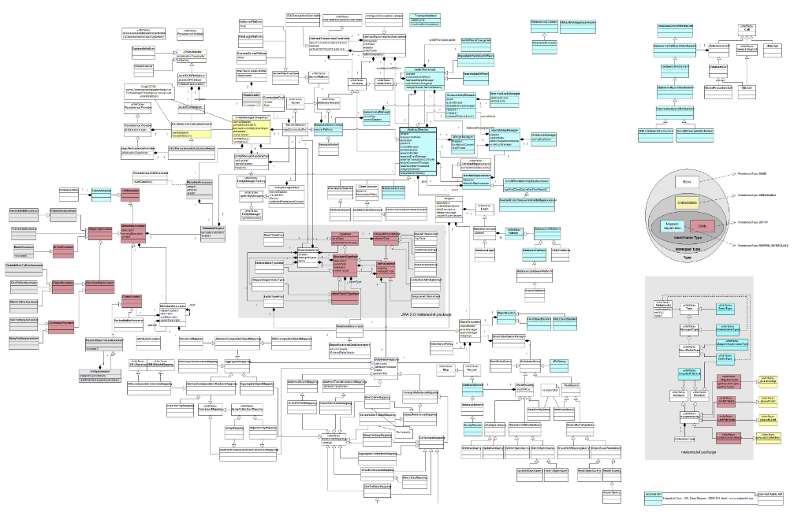

<!--
master: title-page
custom:
 0:
   padding-top: 10%
   padding-bottom: 0%
   margin: 0
 1:
   margin: 0
 2:
   font-size: 23px
   color: blue
-->


# We are not Object Oriented anymore
## by __@matteocollina__

---
<!--
master: image
custom:
  1:
    padding-top: 2.5%
    width: 60%
-->
# __Back to School__

---
<!--
master: image
custom:
  1:
    padding-top: 2.5%
    width: 120%
-->
# __Back to School__

---
<!--
master: image
custom:
  1:
    padding-top: 2.5%
    width: 120%
-->
# __Back to School__

---

<!--
master: section-title
-->

# __What is an Object?__
---

<!--
master:
custom:
 1:
   padding-top: 8%
-->

# __Objects Provide__
- Encapsulation
- Accessors
- Abstraction
- Inheritance
- Polymorphism
---

<!--
master: code
-->

# __Objects Provide Encapsulation__
```javascript
function myFunc (obj) {
  return function () {
    return obj.doSomething()
  }
}
```
---

<!--
master: image
custom:
 1:
   width: 60%
-->

# __Objects Provide Accessors__

## Do we really need them?
---

<!--
master: code
-->

# __Objects Provide Accessors__
```javascript
class Person {
  constructor (name) { this._name = name }
  get name () { return this._name }
  set name (val) { this._name = val}
}
```
---

<!--
master:
custom:
 1:
   padding-top: 5%
-->

# __Are Accessors Useful?__
- to execute code and compute a variable
- but not for JSONificable content
---

<!--
master: code
-->

# __Objects Provide Inheritance__
```javascript
class Person { }
class Student extends Person {}
```
---

<!--
master:
custom:
 1:
   padding-top: 5%
-->

# __Objects Provide Inheritance__
- is inheritance needed?
- is inheritance really remotable?
- is inheritance good for domain data?
- is inheritance good for frameworks?
---

<!--
master: section-title
-->

# __Objects are GOOD__
---

<!--
master: image
custom:
  0: 
    width: 130%
-->


---

<!--
master:
custom:
 1:
   padding-top: 5% 
-->

# __Are Classes Good?__
- Yes, they encapsulate behavior
---

<!--
master: code
-->

# __Are Models Good?__
```javascript
class Person {
  save (cb) {
    db.save(cb)
  }
}
```
---

<!--
master:
custom:
 1:
   padding-top: 5%
-->

# __Are fat models Good?__
- is it a behavior of a model to save itself?
- is it good to encapsulate a database connection in a model
- how can we distribute model access
---

<!--
master:
custom:
 1:
   padding-top: 5%
-->

# __Solution: Let's encapsulate the model!__
- Java Remote Method Invocation
- COBRA
- REST?
---

<!--
master:
custom:
 1:
   padding-top: 5%
-->

# __Solution: Build internal API's!__
- API's as a form of communication between teams!
- GOOD API's!
- API's for the sake of distributing!
- BAD APT's!
---

<!--
master:
custom:
 1:
   padding-top: 5%
-->

# __...but I only wanted to access my data!__
- no code is better than any code
- code for the sake of code is technical debt
- is there something wrong?
---

<!--
master: image
-->


[](https://vimeo.com/108441214)
---

<!--
master: section-title
custom:
 0:
   font-size: 32px
-->

# “Writing code for the sole purpose of deleting it” - __Greg Young__

---

<!--
master: section-title
custom:
 0:
   font-size: 32px
-->

# “All code is sh*t” - __Matteo Collina__

---

<!--
master: image
custom:
 0:
   padding-top: 5%
   padding-left: 22%
-->


---

<!--
master: section-title
-->

# __What if we design messages and not models?__
---

<!--
master: section-title
custom:
 0:
   font-size: 32px
-->

# “The key in making great and growable systems is much more to design how its modules communicate rather than what their internal properties and behaviors should be.” - __Alan Key, father of OOP__

---

<!--
master: image
custom:
  0:
    width: 80%
-->

---

<!--
master:
custom:
 1:
   padding-top: 5%
-->

# __What is a message?__
- Maps
- Arrays
- Strings
- Numbers
- Binary data?
- Streams of data
---

<!--
master: code
-->

# __The anatomy of a message__
```javascript
{
  person: {
    name: 'Matteo'
    surname: 'Collina'
  }
}
```
---

<!--
master: code
-->

# __The anatomy of a message__
```javascript
recipient(message, function (err, result) {
  console.log(err, result)
})
```
## result is another message
---

<!--
master: code
-->

# __Node Callback Style__
```javascript
func(msg, function myFunc(err, arg1, arg2, ...) {
  /*
  this is called asynchronously
  err contains an Error object
  */
})
```
---

<!--
master:
custom:
 1:
   padding-top: 5%
-->

# __Node Callback Style__
- async by default
- no difference if wrapping a db, or a remote endpoint
- Promises are ok as well :)
---

<!--
master:
custom:
 1:
   padding-top: 5%
-->

# __How to remote a function call?__
- how do we encode which function to call
- truly multi transport from day zero
- we can store it in the message
---

<!--
master: code
-->

# __Final message__
```javascript
{
  role:'person',
  cmd:'save'
  person: {
    name:'Matteo'
    surname: 'Collina'
  }
}
```
---

<!--
master: image
custom:
  1:
    width: 120%
    padding-top: 8%
-->
# __Command pattern!__

---

<!--
master:
custom:
 1:
   padding-top: 5%
-->

# __Command pattern!__
- we do not want a massive switch/case
- ifs are not good either
---

<!--
master: 
custom:
 0:
   padding-top: 7%
 1:
   padding-top: 7%
   font-size: 36px
 2:
   padding-top: 2.5%
   color: gray
   font-size: 36px
-->


## We call such a way of composing code a
## __Microservice__

---

<!--
master: image
custom:
  0:
    width: 120%
    padding-top: 5%
  1:
    font-size: 40px
-->

## http://senecajs.org

---

<!--
master: image
custom:
  0:
    width: 70%
  1:
    height: 90%
    width: 90%
    font-size: 20px
-->

```javascript
var seneca = require('seneca')()
seneca.add({
  role:'user',
  cmd:'login'
}, function (args, callback) {
  var loggedIn = args.username === 'matteo' &&
                 args.password === 'collina'
  callback(null, { loggedIn:loggedIn })
})
seneca.listen()
```
---

<!--
master: image
custom:
  0:
    width: 70%
  1:
    height: 90%
    width: 90%
    font-size: 20px
-->

```javascript
var seneca = require('seneca')()
var client = seneca.client()
client.act({
  role:'user',
  cmd:'login',
  username:'matteo',
  password:'collina'
}, function (err, result) {
      console.log(result.loggedIn)
})
```
---

<!--
master: image
-->


## Features
### multiple transports, from bare TCP to busses
### build a monolith, and then split it away
### deep inspection & debugging tools
### authentication/user management system
### control panel
### integration with HAPI
---

<!--
master: image
custom:
  1:
    padding-top: 5%
    font-size: 30px
-->

## DEMO!
---

<!--
master: image
custom:
  1:
    padding: 2%
  2:
    font-size: 28px
    padding: 2%
    margin: 0
  3:
    font-size: 28px
    padding: 2%
    margin: 0
  4:
    font-size: 28px
    padding: 2%
    margin: 0

-->


## This presentation
### https://github.com/mcollina/we-are-not-object-oriented-anymore
### https://mcollina.github.io/we-are-not-object-oriented-anymore
### https://github.com/mcollina/we-are-not-object-oriented-anymore-demo

---

<!--
master: image
custom:
  0:
    width: 120%
-->

---

<!--
master: title-page
custom:
 1:
  font-size: 28px
  padding-bottom: 2%
 2:
  margin: 0
  padding: 0
  color: blue
 3:
  margin: 0
  padding: 0
  color: blue 
 4:
  margin: 0
  padding: 0
  color: blue  
-->

# __Thanks!__
## If you need help with Node.js
## matteo.collina@nearform.com
## @matteo.collina on Twitter
## www.nearform.com
---
