<!--
master: title-page
-->

# We are not Object Oriented anymore
## by __@matteocollina__

---
<!--
master: image-plain
-->

## __Back to School__
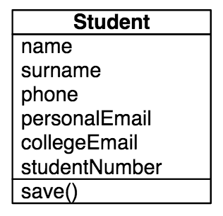
---

<!--
master: image-plain
-->

## __Back to School__
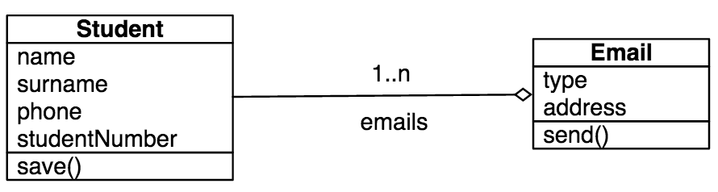
---

<!--
master: image-plain-alt
-->

## __Back to School__
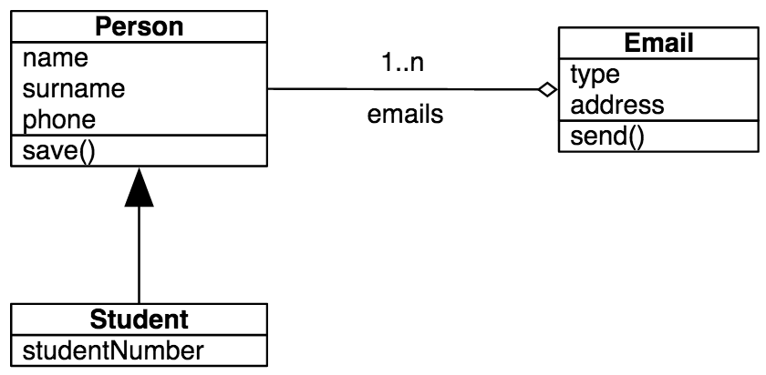
---

<!--
master: splash
-->

## __What is an Object?__
---

<!--
master: text-list
-->

## __Objects Provide__
### Encapsulation
### Accessors
### Abstraction
### Inheritance
### Polymorphism
---

<!--
master: image-lrg
-->

## __Objects Provide Encapsulation__
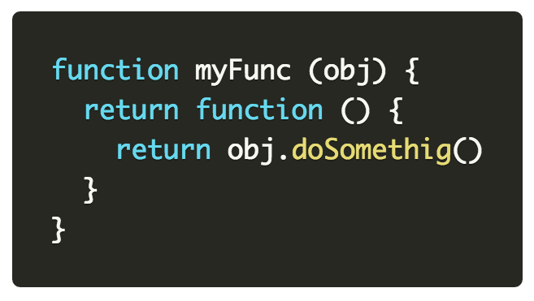
---

<!--
master: image-lrg-alt
-->

## __Objects Provide Accessors__
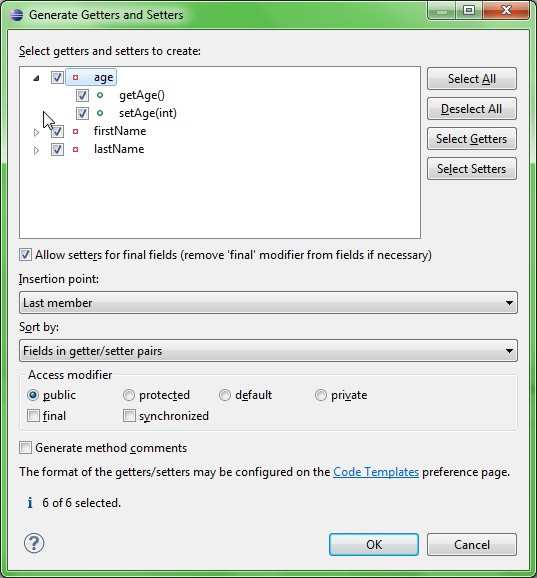
### Do we really need them?
---

<!--
master: image-lrg
-->

## __Objects Provide Accessors__
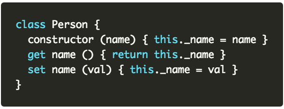
---

<!--
master: splash-alt
-->

## __Are Accessors Useful?__
### to execute code and compute a variable
### but not for JSONificable content
---

<!--
master: image-plain-alt
-->

## __Objects Provide Inheritance__
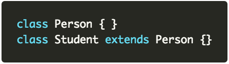
---

<!--
master: text-list-sm
-->

## __Objects Provide Inheritance__
### is inheritance needed?
### is inheritance really remotable?
### is inheritance good for domain data?
### is inheritance good for frameworks?
---

<!--
master: splash
-->

## __Objects are GOOD__
---

<!--
master: splash-plain-image
-->

---

<!--
master: splash-alt
-->

## __Are Classes Good?__
### Yes, they encapsulate behavior
---

<!--
master: image-plain-alt
-->

## __Are Models Good?__
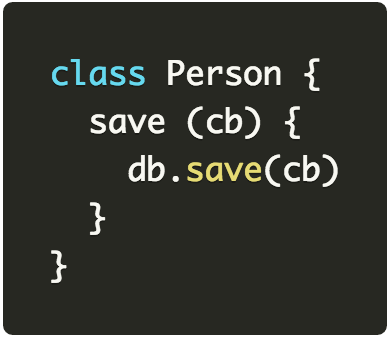
---

<!--
master: text-list-sm
-->

## __Are fat models Good?__
### is it a behavior of a model to save itself?
### is it good to encapsulate a database connection in a model
### how can we distribute model access
---

<!--
master: text-list-sm
-->

## __Solution: Let's encapsulate the model!__
### Java Remote Method Invocation
### COBRA
### REST?
---

<!--
master: text-list-sm
-->

## __Solution: Build internal API's!__
### API's as a form of communication between teams!
### GOOD API's!
### API's for the sake of distributing!
### BAD APT's!
---

<!--
master: text-list-sm
-->

## __...but I only wanted to access my data!__
### no code is better than any code
### code for the sake of code is technical debt
### is there something wrong?
---

<!--
master: image-plain-central
-->

[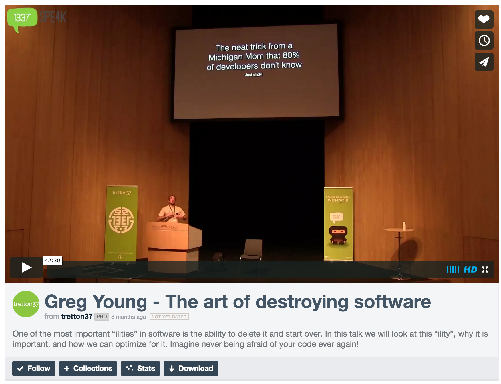](https://vimeo.com/108441214)
---

<!--
master: quote
-->

## “Writing code for the sole purpose of deleting it” - __Greg Young__

---

<!--
master: quote
-->

## “All code is sh*t” - __Matteo Collina__

---

<!--
master: image-plain-central
-->

---

<!--
master: splash-alt
-->

## __What if we design messages and not models?__
---

<!--
master: quote
-->

## “The key in making great and growable systems is much more to design how its modules communicate rather than what their internal properties and behaviors should be.” - __Alan Key, father of OOP__

---

<!--
master: image-medium-central
-->
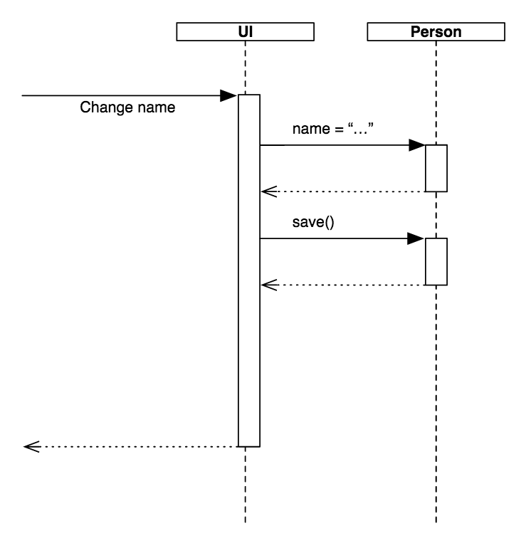
---

<!--
master: text-list-sm
-->

## __What is a message?__
### Maps
### Arrays
### Strings
### Numbers
### Binary data?
### Streams of data
---

<!--
master: image-lrg
-->

## __The anatomy of a message__
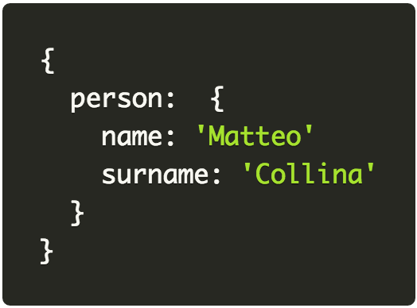
---

<!--
master: image-lrg
-->

## __The anatomy of a message__
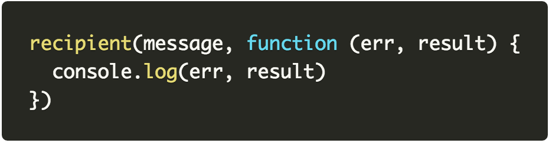
### result is another message
---

<!--
master: image-lrg
-->

## __Node Callback Style__
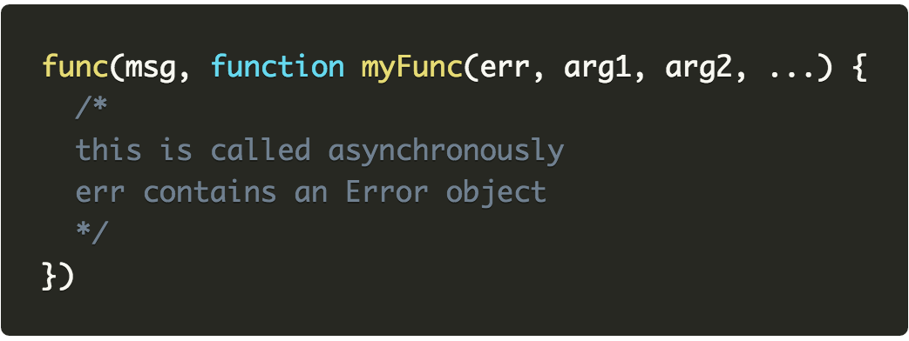
---

<!--
master: splash-alt
-->

## __Node Callback Style__
### async by default
### no difference if wrapping a db, or a remote endpoint
### Promises are ok as well :)
---

<!--
master: splash-alt
-->

## __How to remote a function call?__
### how do we encode which function to call
### truly multi transport from day zero
### we can store it in the message
---

<!--
master: image-lrg
-->

## __Final message__
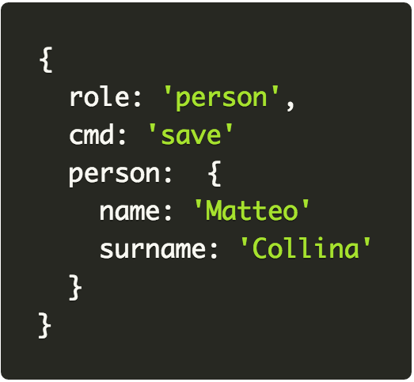
---

<!--
master: image-lrg
-->

## __Command pattern!__
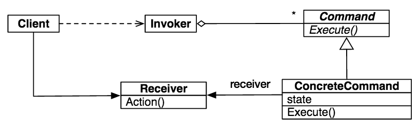
---

<!--
master: splash-alt
-->

## __Command pattern!__
### we do not want a massive switch/case
### ifs are not good either
---

<!--
master: title-alt
-->

## We call such a way of composing code a
## __Microservice__

---

<!--
master: image-lrg
-->

#### http://senecajs.org

---

<!--
master: image-twin
-->

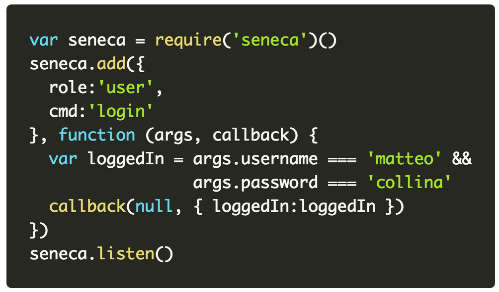
---

<!--
master: image-twin
-->

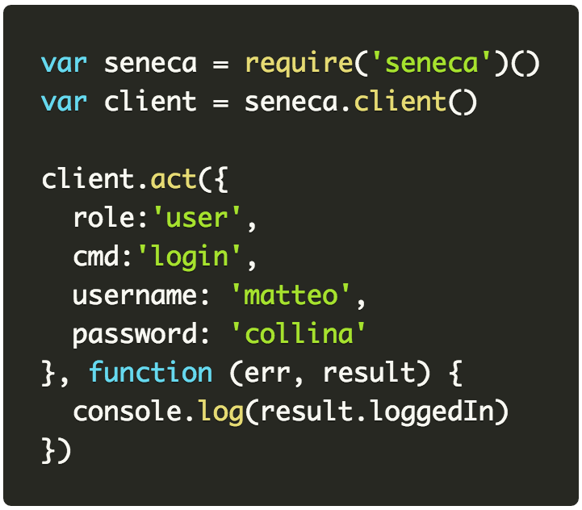
---

<!--
master: image-twin
-->

## Features
### multiple transports, from bare TCP to busses
### build a monolith, and then split it away
### deep inspection & debugging tools
### authentication/user management system
### control panel
### integration with HAPI
---

<!--
master: image-twin
-->

## DEMO!

---

<!--
master: image-twin
-->

## This presentation
### https://github.com/mcollina/we-are-not-object-oriented-anymore
### https://mcollina.github.io/we-are-not-object-oriented-anymore
### https://github.com/mcollina/we-are-not-object-oriented-anymore-demo

---

<!--
master: image-lrg-central
-->

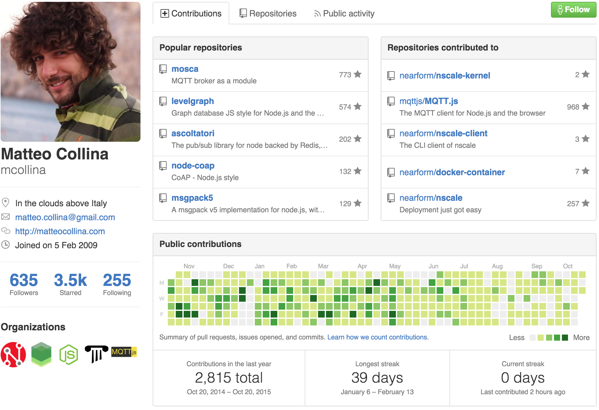
---

<!--
master: text-list
-->

## __Thanks!__
### If you need help with Node.js
#### matteo.collina@nearform.com
#### @matteo.collina on Twitter
#### www.nearform.com
---
